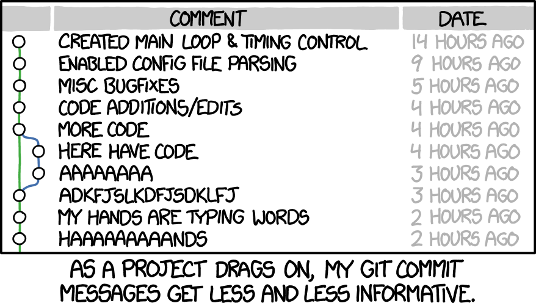

*distributed version control*

## Why git?

For developers weaned on Git it is probably hard to imagine how one could develop without it. For the rest of us Team Foundation Server has always been the version control system of choice because Microsoft promoted it before their acquisition of GitHub.

Conceptually, Team Foundation Server is a **centralized** version control system in which source code revisions are stored on a server and all source control operations are carried out by the Team Foundation Server server process.

Git, on the other hand, is a **distributed** version control system in which all version control information for each repository also resides on every developer's workstation. Thus, Git prioritizes offline workflows, micro-commits, and other behaviors that might be cumbersome to perform when using a traditional non-distributed version control system. 

Although there are other significant differences like fine-grained access control to specific files and folders within repositories and the maturity of large file support (as alluded to above), Git's unchallenged ubiquity as the version control system of choice for modern software development, not to mention its deep integration and support within all five major "big tech" companies (the so-called FAANGs), make it the obvious choice for future-facing software development workflows.

## Install git

As a developer, much of your interaction with Github will be via the command line where you will issue `git` and `gh` commands to accomplish various tasks. The `gh` command is specific to Github and requires you to authenticate with it interactively before you can use it. The `git` command, on the other hand, is a more general tool and will work with any properly configured Git repository or hosting service and requires minimal to no additional configuration to function.

To install Git properly we will use a pre-configured settings file and pass it to winget as an override to its default settings :

```
Invoke-WebRequest -Uri "https://git.io/JXGyd" -OutFile "git.settings.inf"`
winget install Git.Git --override '/SILENT /LOADINF="git.settings.inf"'
# restart shell to reload PATH
```

While we're at it let's configure Git with our name and email address. This information will get appended to each git commit we make.

```
git config --global user.email "you@transpak.com"
git config --global user.name "Your Name"
```

Also, even though we are on Windows our source code should be able to be processed by Linux, macOS, and BSD-based systems as well. To insure when we commit a file to source control the appropriate conversion takes place let's configure git to handle the job for us : 

`git config --global core.autocrlf input`

## Create a Github account

To get started with Github you will first need to launch your browser and [create an account](https://github.com/join). To familiarize yourself with basic concepts and terminology you should also complete Github's short, browser-based version of the ubiquitous [hello world](https://guides.github.com/activities/hello-world/) example before continuing.

> **Note:** Before you can start to work with official TransPak repositories on Github you need to submit a request with IT to [link your Github account with TransPak's corporate account](https://github.com/transpak-development). You don't need to have a linked account to complete this guide but later guides will require you to access TransPak's official repositories.

## Install Github

To install `gh`, the Github CLI, issue the following command. Don't forget that you need to restart Windows Terminal so that PowerShell will recognize the update to your path.

```
 winget install GitHub.cli
# restart shell to reload PATH
```

Next, we will authenticate with Github on behalf of the gh command :

`gh auth login`

This command will prompt you to interact with the application via the terminal. This happens often with the `gh` command. We will step-through this interaction in detail to help familiarize you with the general process.

You are first asked if you want to authenticate using a standard Github account or an enterprise account. Choose **Github.com** using the arrow keys and then press enter.

```
% gh auth login
? What account do you want to log into?
> GitHub.com
  GitHub Enterprise Server
```

Next you are asked whether you wish to use HTTPS or SSH when interacting with the remote repository. Choose **SSH** using the arrow keys on your keyboard and again press enter to continue. 

```
% gh auth login
? What account do you want to log into? GitHub.com
? What is your preferred protocol for Git operations?
  HTTPS
> SSH
```

In the next step you are asked if you would like a new SSH key pair to be created and added for you automatically. Respond with **Y**. You are then asked to optionally provide a passphrase. Although you should use a passphrase to secure your SSH key, in practice, most do not.

```
% gh auth login
? What account do you want to log into? GitHub.com
? What is your preferred protocol for Git operations? SSH
? Generate a new SSH key to add to your GitHub account? (Y/n)
? Enter a passphrase for your new SSH key (Optional)
```

>**Note:** If you already have one or more SSH key pairs on your system you will instead be asked which to add to your Github account. 

At this point `gh` will create a `.ssh` folder in the root of your `%USERPROFILE%` and add two new files, `id_ed25519` and `id_ed25519.pub` The former contains your new Github SSH private key which only resides on your system and should be closely guarded. The latter contains the matching public key which is both stored locally and uploaded to Github. 

<Note: ***"Keep it SECRET, keep it SAFE!"\*** Anyone with access to your Github *private* key can modify source code in your name!

Before the `gh` command can upload your public key to Github, however, we need to authenticate with Github on its behalf. When prompted how you would like to authenticate select **Login with a web browser** :

```
% gh auth login
? What account do you want to log into? GitHub.com
? What is your preferred protocol for Git operations? SSH
? Generate a new SSH key to add to your GitHub account? (Y/n)
? Enter a passphrase for your new SSH key (Optional)
? How would you like to authenticate GitHub CLI?
> Login with a web browser
  Paste an authentication token
```

At this point Github CLI will provide you with a one-time code you need to submit to Github. Hit enter to have Github CLI open the browser for you and load the correct page. When you are done the screen should look like the following :

```
% gh auth login
? What account do you want to log into? GitHub.com
? What is your preferred protocol for Git operations? SSH
? Generate a new SSH key to add to your GitHub account? (Y/n)
? Enter a passphrase for your new SSH key (Optional)
? How would you like to authenticate GitHub CLI? Login with a web browser

! First copy your one-time code: XXXX-XXXX
- Press Enter to open github.com in your browser...
✓ Authentication complete. Press Enter to continue...

- gh config set -h github.com git_protocol ssh
✓ Configured git protocol
✓ Logged in as berkeleynerd
```

We should note that everything you can do with the `gh` command can also be done via Github's website ... just less efficiently!

## Writing good commit messages



At TransPak we should refer to [this post](https://chris.beams.io/posts/git-commit/) when we are on-boarding new hires to explain how to write a good git commit message. The TL;DR is that git commit messages should be concise, consistent in length, and adhere to the following seven rules :

1. [Separate the subject from the body with a blank line](https://chris.beams.io/posts/git-commit/#separate)
2. [Limit the subject to 50 characters](https://chris.beams.io/posts/git-commit/#limit-50)
3. [Capitalize the subject line](https://chris.beams.io/posts/git-commit/#capitalize)
4. [Do not end the subject line with a period](https://chris.beams.io/posts/git-commit/#end)
5. [Use the imperative mood in the subject line](https://chris.beams.io/posts/git-commit/#imperative)
6. [Wrap the body at 72 characters](https://chris.beams.io/posts/git-commit/#wrap-72)
7. [Use the body to explain *what* and *why*, not *how*](https://chris.beams.io/posts/git-commit/#why-not-how)
